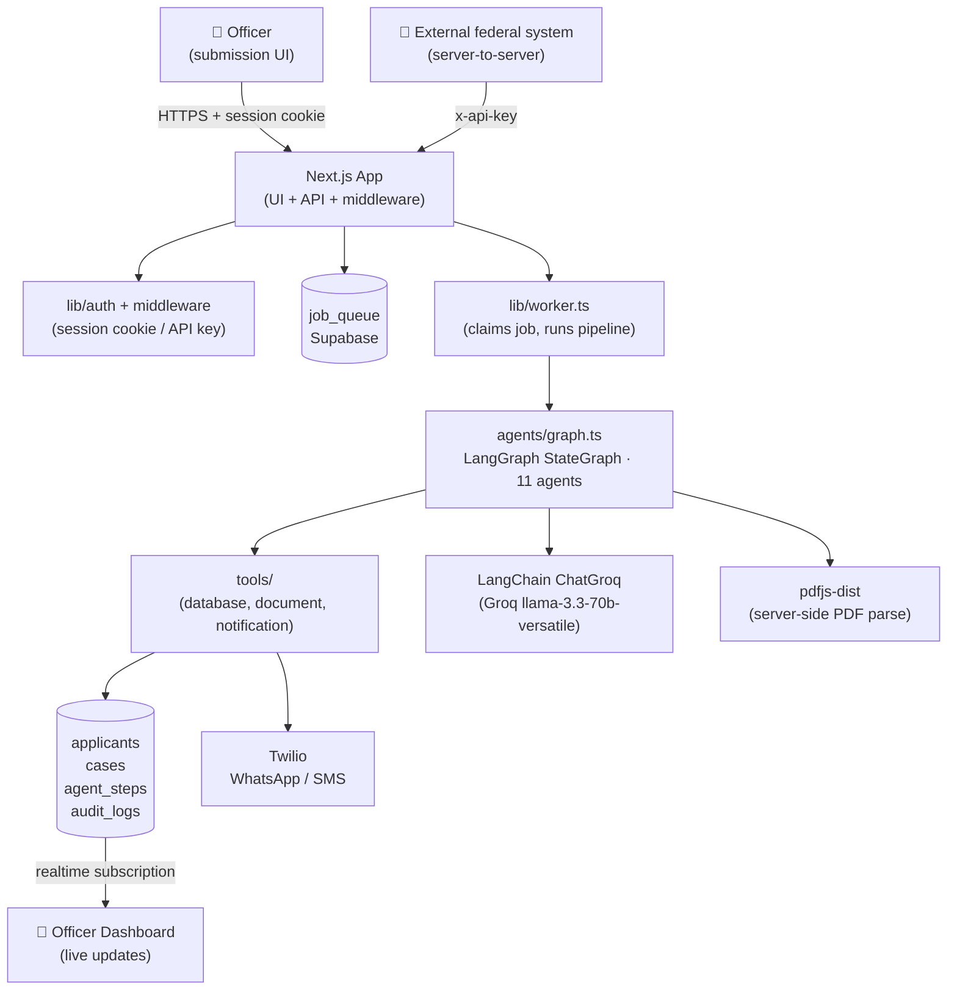
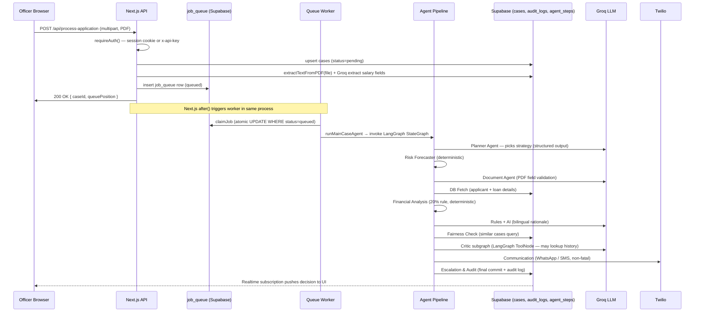
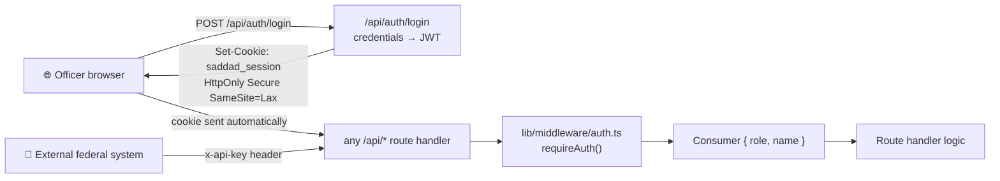
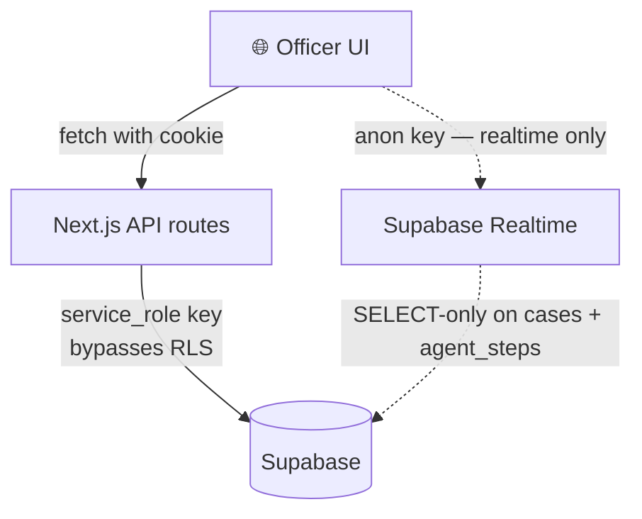
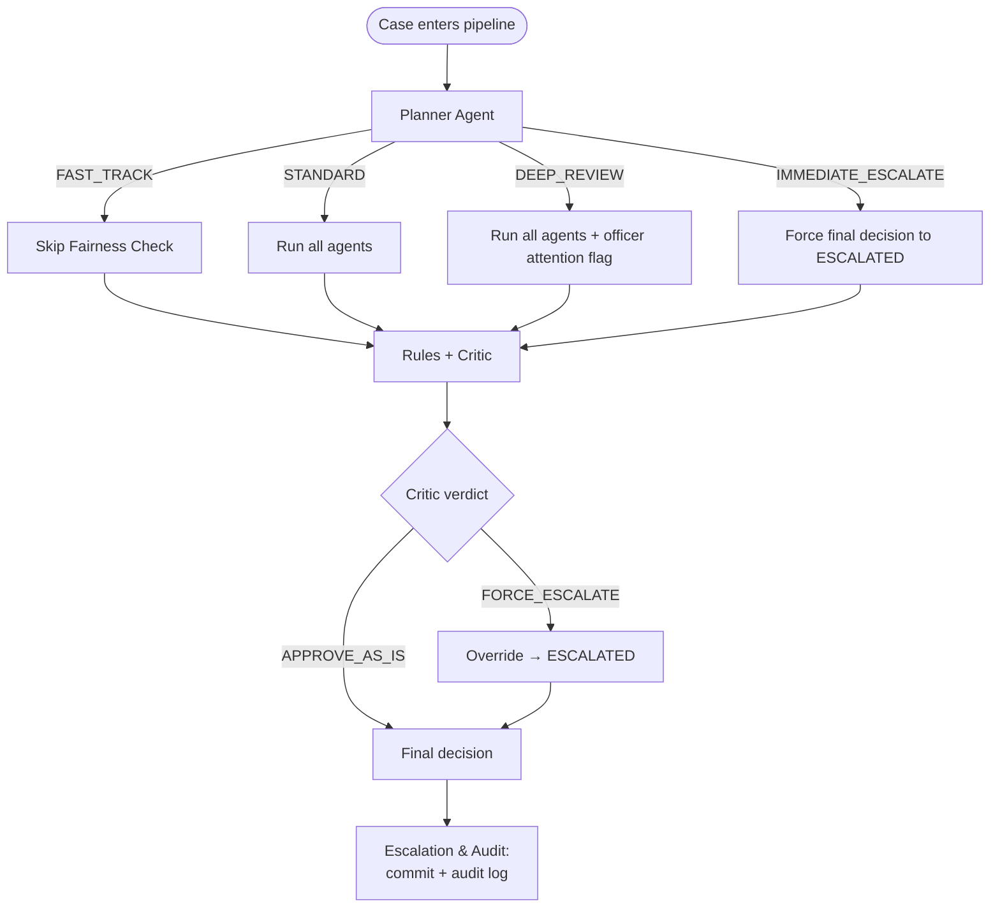

# SADDAD — System Architecture

## At a glance



## Folder structure as a story

```
housing-arrears-agent/
├── agents/             ← The 11-agent decision pipeline (LangGraph)
│   ├── graph.ts                compiled StateGraph (topology)
│   ├── graph-state.ts          typed shared state (Annotation)
│   ├── types.ts                shared agent types
│   ├── planner-agent.ts        decides strategy (node)
│   ├── critic-agent.ts         LangGraph tool subgraph with veto
│   ├── main-case-agent.ts      invokes the compiled graph
│   └── ...
├── governance/         ← Per-service rule engines (platform extensibility)
│   ├── types.ts                    ← ServiceModule contract + shared evaluateRules() engine
│   ├── registry.ts                 ← service id → module registry
│   ├── housing-arrears.ts          ← active rules (G-01 through G-06)
│   └── visa-renewal.ts             ← second federal service (wired + tested)
├── tools/              ← MCP-compatible external integrations
│   ├── database-tools.ts
│   ├── document-tools.ts
│   └── notification-tools.ts
├── lib/                ← Plumbing: auth, sessions, supabase client, queue worker
├── app/                ← Next.js routes (UI + API)
├── components/         ← React components
├── tests/              ← 36 unit tests covering governance, financial math, cross-service registry + LLM-client wiring
├── supabase/           ← Database schema + migrations
└── docs/               ← Strategic + operational documentation
```

The folder layout is intentional. The three folders that tell the story of what SADDAD is — `agents/`, `governance/`, `tools/` — live at the root, not buried inside `lib/`. A judge or new engineer opens the repo and sees the architecture in the file tree before reading a single line of code.

## Request lifecycle — submission to decision



## Auth model

Two paths in, one path of trust:



- **Browser users** authenticate via cookie session (HTTP-only, signed JWT)
- **External federal systems** use the x-api-key header (server-to-server only)
- Both resolve to the same `Consumer { role, name }` shape so route handlers stay simple
- `NEXT_PUBLIC_API_KEY_*` env vars are deliberately gone — no auth secrets cross to the browser

## Data flow with RLS enforcement



- Backend uses `SUPABASE_SERVICE_ROLE_KEY` exclusively — bypasses RLS, full table access
- Browser only touches Supabase for realtime subscriptions, using the public anon key
- RLS policies allow anon SELECT on `cases` and `agent_steps` (needed for realtime) but block everything on PII tables (`applicants`, `audit_logs`, `job_queue`)
- A leaked anon key cannot read applicant PII or audit logs

## Pipeline strategy mapping

The Planner Agent chooses one of four strategies. Each maps to a different execution path:



## Why this architecture is appropriate for regulated AI

| Concern | Architecture answer |
|---|---|
| Decisions must be defensible | Every agent writes to `agent_steps`; every final decision writes to immutable `audit_logs` |
| Hard rules must be deterministic | `governance/housing-arrears.ts` is pure functions, unit-tested 51/51 |
| LLM cannot override hard rules | Hard `REJECTED` and `ESCALATED` are sticky; LLM may only escalate `APPROVED` |
| PII must be protected at rest | RLS policies block all anon access to applicants/audit tables; service-role key never leaves the server |
| AI failures must not corrupt state | Communication agent is non-fatal; worker catch-block calls `upsertCaseDecision` with a base-columns fallback so cases never stick at `pending` |
| Schema evolution must not break writes | `upsertCaseDecision` writes core fields first (always succeed), extended fields second (silently skip if column missing) |
| Service must scale to other federal entities | Pipeline is service-agnostic; only `governance/<service>.ts` changes per service (~2-3 engineer weeks per new service) |
